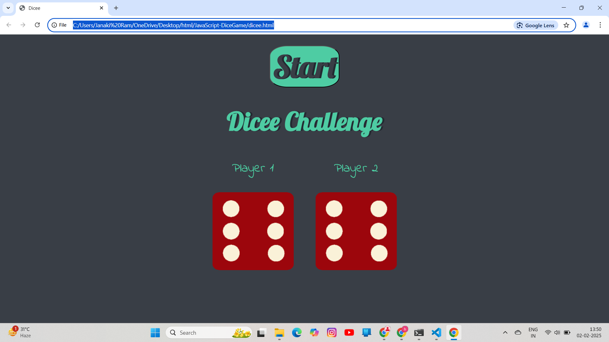

# 🎲 JavaScript Dice Game

A fun and simple dice game built using **HTML, CSS, and JavaScript**. Players roll two dice, and the one with the higher number wins!

## 🚀 Live Demo
🔗 [Play the Game](https://janakiramkusu.github.io/JavaScript-DiceGame/) 

## 📸 Screenshot
 

## 📜 How to Play
1. Click the **Start** button.
2. The dice roll automatically.
3. The player with the higher number wins, or it's a draw!

## 🛠 Technologies Used
- HTML5
- CSS3
- JavaScript (DOM Manipulation)

